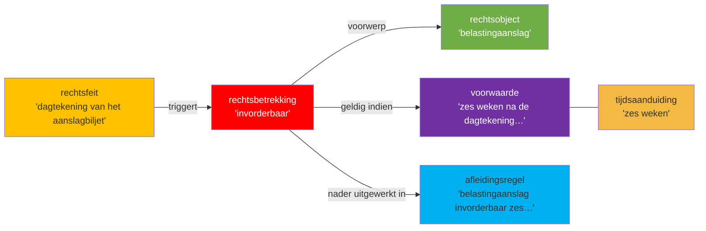

## Wetstekst lid 1 (letterlijk)

> **1** Een belastingaanslag is invorderbaar zes weken na de dagtekening van het aanslagbiljet.

## Annotatietabel

| Nr | Markering (letterlijk incl. lidwoord en verwijzingen) | JAS-klasse | Interpretatiemethode | Begrip | Signalering |
|----|------------------------------------------------------|-----------|---------------------|--------|-------------|
| 1 | "Een belastingaanslag" | **rechtsobject** | grammaticaal | [[begrippen/belastingaanslag]] | — |
| 2 | "is invorderbaar" | **rechtsbetrekking** | grammaticaal | [[begrippen/invorderbaarheid]] | ⚠ rechtssubjecten (belastingschuldige, ontvanger) niet expliciet benoemd in lid 1; impliciet via art. 2 en 3 IW 1990 |
| 3 | "zes weken na de dagtekening van het aanslagbiljet" | **voorwaarde** | grammaticaal | [[begrippen/zes-weken-na-dagtekening-aanslagbiljet]] | — |
| 4 | "zes weken" | **tijdsaanduiding** | grammaticaal | [[begrippen/zes-weken]] | — |
| 5 | "de dagtekening van het aanslagbiljet" | **tijdsaanduiding** | systematisch | [[begrippen/dagtekening-aanslagbiljet]] | ⚠ dubbelclassificatie: ook rechtsfeit (nr. 6); dagtekening markeert zowel het aanvangstijdstip van de invorderingstermijn als het rechtsscheppende moment dat de termijn doet ingaan |
| 6 | "de dagtekening van het aanslagbiljet" | **rechtsfeit** | systematisch | [[begrippen/dagtekening-aanslagbiljet]] | ⚠ hergebruik begrip-noot (zie nr. 5); als rechtsfeit: de dagtekening is de handeling waaraan het rechtsgevolg (aanvang invorderingstermijn) is verbonden |
| 7 | "Een belastingaanslag is invorderbaar zes weken na de dagtekening van het aanslagbiljet." | **afleidingsregel** | systematisch | [[begrippen/invorderbaarheid-belastingaanslag]] | — |

## Diagram

### Diagram 1 — lid 1: invorderbaarheid van de belastingaanslag

