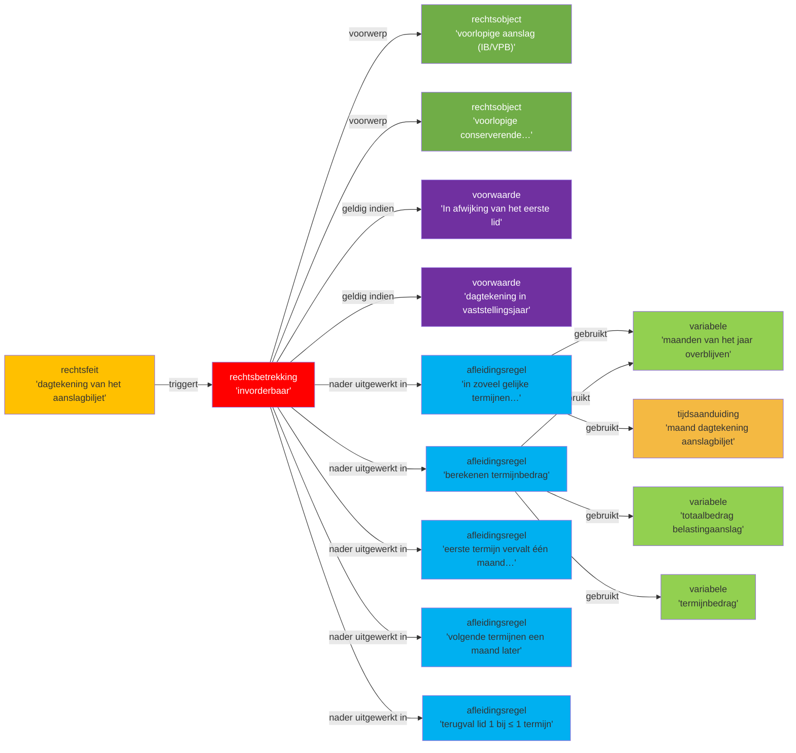

## Wetstekst lid 5 (letterlijk)

> **5** In afwijking van het eerste lid is een voorlopige aanslag in de inkomstenbelasting of in de vennootschapsbelasting en een voorlopige conserverende aanslag in de inkomstenbelasting, waarvan het aanslagbiljet een dagtekening heeft die ligt in het jaar waarover deze is vastgesteld, invorderbaar in zoveel gelijke termijnen als er na de maand, die in de dagtekening van het aanslagbiljet is vermeld, nog maanden van het jaar overblijven. De eerste termijn vervalt één maand na de dagtekening van het aanslagbiljet en elk van de volgende termijnen telkens een maand later. Indien de toepassing van de eerste volzin niet leidt tot meer dan één termijn, vindt het eerste lid toepassing.

## Annotatietabel

| Nr | Markering (letterlijk incl. lidwoord en verwijzingen) | JAS-klasse | Interpretatiemethode | Begrip | Signalering |
|----|------------------------------------------------------|-----------|---------------------|--------|-------------|
| 1 | "een voorlopige aanslag in de inkomstenbelasting of in de vennootschapsbelasting" | **rechtsobject** | grammaticaal | [[begrippen/voorlopige-aanslag]] | — |
| 2 | "of" | **operator** | grammaticaal | [[begrippen/logische-of]] | ⚠ logische OR; verbindt IB en VPB als alternatieve belastingsoorten voor het toepassingsbereik van lid 5 |
| 3 | "een voorlopige conserverende aanslag in de inkomstenbelasting" | **rechtsobject** | grammaticaal | [[begrippen/voorlopige-conserverende-aanslag-ib]] | — |
| 4 | "is ... invorderbaar" | **rechtsbetrekking** | grammaticaal | [[begrippen/invorderbaarheid]] | ⚠ hergebruik begrip-noot; rechtssubjecten niet expliciet in lid 5; impliciet via art. 3 IW 1990. Soort-consistentiecheck: `invorderbaarheid` heeft `soort: waar-niet-waar` (binair); in lid-5-context is invorderbaarheid per termijn — soort incompatibel. A5-signaal: de wet bepaalt wanneer termijnen vervallen maar articuleert niet hoe de status per termijn op een peildatum wordt vastgesteld; dit vereist uitvoeringsbeleid of een implementatielaag. |
| 5 | "In afwijking van het eerste lid" | **voorwaarde** | systematisch | [[begrippen/in-afwijking-van-eerste-lid]] | ⚠ specialisatiebepaling; markeert lid 5 als lex specialis t.o.v. art. 9 lid 1 voor de genoemde voorlopige aanslagen |
| 6 | "waarvan het aanslagbiljet een dagtekening heeft die ligt in het jaar waarover deze is vastgesteld" | **voorwaarde** | grammaticaal | [[begrippen/dagtekening-in-vaststellingsjaar]] | ⚠ kwalificatieconditie: beperkt lid 5 tot aanslagen met een dagtekening in het belastingjaar; aanslagen vóór het jaar vallen onder lid 7 |
| 7 | "de dagtekening van het aanslagbiljet" | **rechtsfeit** | systematisch | [[begrippen/dagtekening-aanslagbiljet]] | ⚠ hergebruik begrip-noot; hier als ankerpunt voor de termijnenberekening in lid 5 |
| 8 | "de maand, die in de dagtekening van het aanslagbiljet is vermeld" | **tijdsaanduiding** | grammaticaal | [[begrippen/maand-dagtekening-aanslagbiljet]] | — |
| 9 | "in zoveel gelijke termijnen als er na de maand, die in de dagtekening van het aanslagbiljet is vermeld, nog maanden van het jaar overblijven" | **afleidingsregel** | systematisch | [[begrippen/termijnenberekening-resterende-maanden]] | — |
| 10 | "nog maanden van het jaar overblijven" | **variabele** | grammaticaal | [[begrippen/resterende-maanden-jaar]] | — |
| 11 | "In afwijking van het eerste lid is een voorlopige aanslag in de inkomstenbelasting of in de vennootschapsbelasting en een voorlopige conserverende aanslag in de inkomstenbelasting, waarvan het aanslagbiljet een dagtekening heeft die ligt in het jaar waarover deze is vastgesteld, invorderbaar in zoveel gelijke termijnen als er na de maand, die in de dagtekening van het aanslagbiljet is vermeld, nog maanden van het jaar overblijven." | **afleidingsregel** | systematisch | [[begrippen/invorderbaarheid-in-gelijke-termijnen]] | ⚠ specialisatieregel t.o.v. art. 9 lid 1; als-dan: als aan beide kwalificatievoorwaarden is voldaan (aanslagtype én dagtekening in jaar), dan invorderbaar in gelijke maandelijkse termijnen |
| 12 | "De eerste termijn vervalt één maand na de dagtekening van het aanslagbiljet" | **afleidingsregel** | grammaticaal | [[begrippen/vervaldag-eerste-termijn]] | ⚠ reeks-statustoets: deze rekenregel produceert één vervaldatum; samen met markering 14 vormt het een reeks van N datums. De status van elke datum t.o.v. een peildatum is niet in de wettekst gearticuleerd — A5-signaal: ontbrekend uitvoeringsbeleid. |
| 13 | "één maand na de dagtekening van het aanslagbiljet" | **tijdsaanduiding** | grammaticaal | [[begrippen/een-maand-na-dagtekening]] | — |
| 14 | "elk van de volgende termijnen telkens een maand later" | **afleidingsregel** | grammaticaal | [[begrippen/vervaldag-volgende-termijnen]] | ⚠ reeks-statustoets: deze rekenregel produceert een reeks van N−1 vervaldatums (iteratief). Zie ook markering 12. |
| 15 | "telkens een maand later" | **tijdsaanduiding** | grammaticaal | [[begrippen/telkens-een-maand-later]] | — |
| 16 | "Indien de toepassing van de eerste volzin niet leidt tot meer dan één termijn, vindt het eerste lid toepassing." | **afleidingsregel** | systematisch | [[begrippen/terugvalregel-lid-1]] | ⚠ beslissingsregel (terugvalregel); art. 9 lid 1 herneemt toepassing als het termijnenantal ≤ 1 is (bij dagtekening in november of december) |
| 17 | "gelijke" | **afleidingsregel** | systematisch | [[regels/AR-9-5f]] | ⚠ rekenregel voor termijnbedrag; de eis dat termijnen 'gelijk' zijn, dwingt tot de berekening: totaalbedrag / aantal termijnen |
| 18 | "gelijke termijnen" | **variabele** | systematisch | [[begrippen/termijnbedrag]] | ⚠ de variabele die de uitkomst van AR-9-5f representeert |
| 19 | "een belastingaanslag" | **variabele** | systematisch | [[begrippen/totaalbedrag-belastingaanslag]] | ⚠ hergebruik markering uit lid 1; het totaalbedrag is noodzakelijk voor de berekening van het termijnbedrag (invoer voor AR-9-5f) |

## Diagram

### Diagram 1 — lid 5: invorderbaarheid van voorlopige aanslagen in gelijke termijnen

