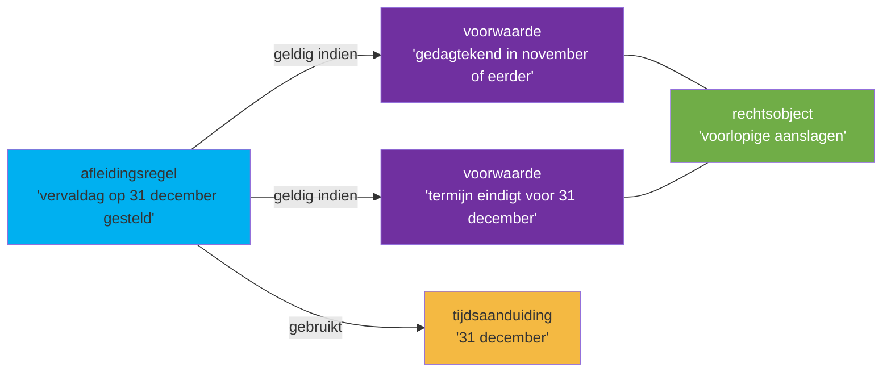

## Wetstekst 9.1 (letterlijk)

> **[9.1]** In de gevallen waarin voor voorlopige aanslagen (bedoeld in [artikel 9, vijfde lid, van de wet](jci1.3:c:BWBR0004770&artikel=9)) die zijn gedagtekend in november of eerder, toepassing van de [wet](jci1.3:c:BWBR0004770) er toe zou leiden dat de enige of laatste betalingstermijn eindigt voor 31 december, dan wordt de vervaldag van deze termijn op 31 december gesteld. Bij afwijkende boekjaren wordt de laatste vervaldag steeds op de laatste dag van de maand gesteld.

## Annotatietabel

| Nr | Markering (letterlijk incl. lidwoord en verwijzingen) | JAS-klasse | Interpretatiemethode | Begrip | Signalering |
|----|------------------------------------------------------|-----------|---------------------|--------|-------------|
| 1 | "voor voorlopige aanslagen (bedoeld in artikel 9, vijfde lid, van de wet)" | **rechtsobject** | systematisch | [[begrippen/voorlopige-aanslag]] | — |
| 2 | "die zijn gedagtekend in november of eerder" | **voorwaarde** | grammaticaal | [[begrippen/dagtekening-in-november-of-eerder]] | — |
| 3 | "toepassing van de wet er toe zou leiden dat de enige of laatste betalingstermijn eindigt voor 31 december" | **voorwaarde** | systematisch | [[begrippen/termijn-eindigt-voor-31-december]] | — |
| 4 | "dan wordt de vervaldag van deze termijn op 31 december gesteld" | **afleidingsregel** | grammaticaal | [[begrippen/vervaldag-31-december]] | **type**: Specialisatieregel (in afwijking van de hoofdregel in art. 9 lid 5 IW 1990) |
| 5 | "31 december" | **tijdsaanduiding** | grammaticaal | [[begrippen/31-december]] | — |
| 6 | "Bij afwijkende boekjaren" | **voorwaarde** | grammaticaal | [[begrippen/afwijkend-boekjaar]] | — |
| 7 | "wordt de laatste vervaldag steeds op de laatste dag van de maand gesteld" | **afleidingsregel** | grammaticaal | [[begrippen/vervaldag-laatste-dag-maand]] | **type**: Specialisatieregel |

## Diagram

### Diagram 1 — sectie 9.1: vervaldag voorlopige aanslag einde jaar

## Delegatiestructuur

Geen delegatiebevoegdheden in artikel 9 LI 2008.
