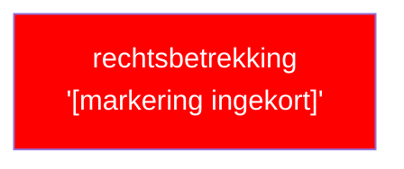

# Templates voor annotatie-noten

Vier templates, elk gekoppeld aan een flow uit SKILL.md.
Geen wikilinks in placeholders (geen dubbele rechte haken rondom plaatshouders) — dit voorkomt fantoomnodes in Obsidian Graph View.

> **Relatie-velden in gegenereerde output wél met wikilinks:**
> De velden `wetstekst`, `onderdeel-van`, `afgeleid-van` en `bepaalt` moeten in de feitelijke noten
> `"[[pad/naar/noot]]"` bevatten (conform SKILL.md output-formaten). De templates tonen het pad als
> platte tekst uitsluitend om Obsidian-scanning van het templatebestand zelf te vermijden.

---

## Template A1 — Wetstekst-noot (Flow A, stap 1)

Pad: wetteksten/[wet]/art[A].md

---
type: wetstekst
artikel: "Art. [A] [W]"
bwb-id: [BWB-ID]
peildatum: [YYYY-MM-DD uit MCP versiedatum]
structuurpositie: "[pad-veld letterlijk uit MCP]"
tags:
  - wetstekst
  - wet/[wet-afkorting]
  - art/[nummer]
bronreferentie: "[bronreferentie-veld uit MCP]"
---

Wetstekst (letterlijk):

> **1** [tekst lid 1]
> **2** [tekst lid 2]

---

## Template A2 — Index-noot, READ-ONLY (Flow A, stap 2)

Pad: annotaties/[wet]/art[A].md

Mag uitsluitend bevatten: frontmatter + delegatiestructuur.
Nooit annotatierijen, diagrammen of interpretaties.

---
type: annotatie
artikel: "Art. [A] [W]"
bwb-id: [BWB-ID]
peildatum: [YYYY-MM-DD uit MCP versiedatum]
structuurpositie: "[pad-veld letterlijk uit MCP]"
tags:
  - annotatie
  - wet/[wet-afkorting]
  - art/[nummer]
wetstekst: wetteksten/[wet]/art[A]
leden-noten: []   # wordt bijgewerkt na elke Flow B: wikilink naar nieuwe lid-noot toevoegen, gesorteerd op lidnummer (zie annoteer/SKILL.md)
kruisreferenties: []
---

## Delegatiestructuur

Geen delegatiebevoegdheden in artikel [A].

---

## Template B — Lid-annotatie-noot (Flow B)

Pad: annotaties/[wet]/art[A]-[L].md

---
type: annotatie
artikel: "Art. [A] lid [L] [W]"
bwb-id: [BWB-ID]
peildatum: [YYYY-MM-DD overnemen uit index-noot]
structuurpositie: "[structuurpositie index-noot] > Lid [L]"
tags:
  - annotatie
  - wet/[wet-afkorting]
  - art/[nummer]
onderdeel-van: annotaties/[wet]/art[A]
wetstekst: wetteksten/[wet]/art[A]
begrippen: []
---

## Wetstekst lid [L] (letterlijk)

> **[L]** [tekst van dit lid]

## Annotatietabel

| Nr | Markering (letterlijk incl. lidwoord en verwijzingen) | JAS-klasse | Interpretatiemethode | Begrip | Signalering |
|----|------------------------------------------------------|-----------|---------------------|--------|-------------|
| 1  | "[citaat]" | **[klasse]** | grammaticaal/systematisch/teleologisch/wetshistorisch | begrippen/[slug] | — |

## Diagram

### Diagram 1 — lid [L]: [omschrijving rechtsbetrekking]

---

## Template C — Sectie-annotatie-noot (Flow C)

Pad: annotaties/[wet]/[slug].md

Gebruik voor bronnen zonder leden: Leidraad Invordering, beleidsregels, e.d.
Geen onderdeel-van, geen leden-noten.

---
type: annotatie
artikel: "[ref zoals in bron, bijv. par 1.1 LI 2008]"
bwb-id: [BWB-ID]
peildatum: [YYYY-MM-DD uit MCP versiedatum]
structuurpositie: "[pad-veld letterlijk uit MCP]"
tags:
  - annotatie
  - wet/[wet-afkorting]
wetstekst: wetteksten/[wet]/[slug]
begrippen: []
kruisreferenties: []
---

## Wetstekst [ref] (letterlijk)

> [tekst van de sectie]

## Annotatietabel

| Nr | Markering (letterlijk incl. lidwoord en verwijzingen) | JAS-klasse | Interpretatiemethode | Begrip | Signalering |
|----|------------------------------------------------------|-----------|---------------------|--------|-------------|
| 1  | "[citaat]" | **[klasse]** | grammaticaal/systematisch/teleologisch/wetshistorisch | begrippen/[slug] | — |

## Diagram

### Diagram 1 — [omschrijving rechtsbetrekking]

## Delegatiestructuur

Geen delegatiebevoegdheden in [ref].
